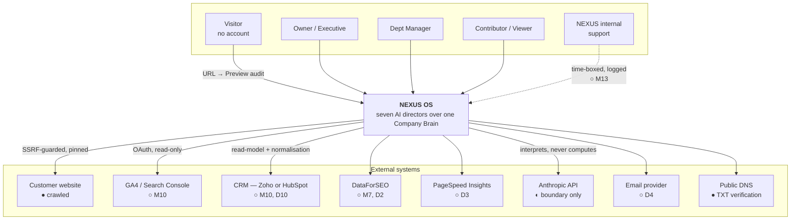
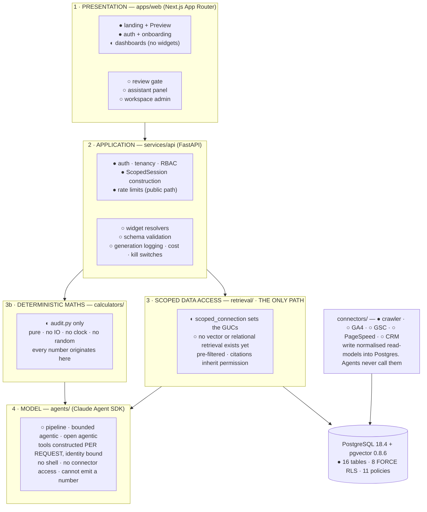
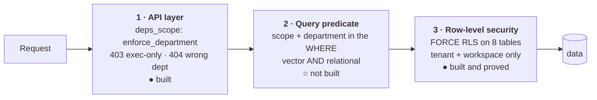
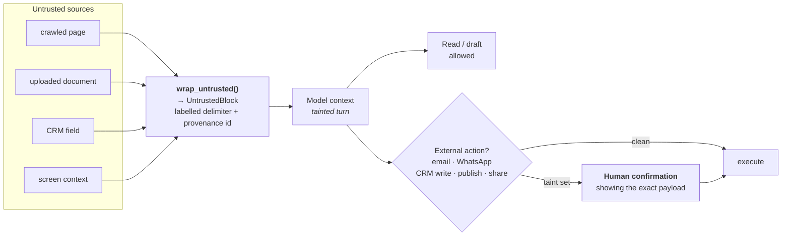
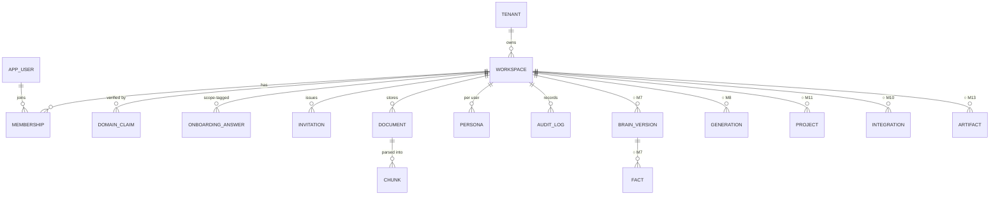
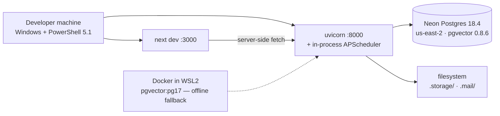
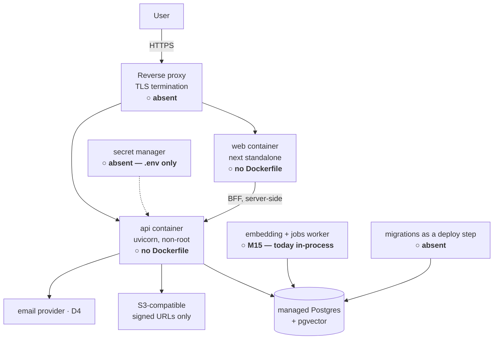

# NEXUS OS — High-Level Design

**Version:** 1.0 · 25 August 2026 · supersedes `doc/archive/ARCHITECTURE.md`
**Scope:** what the system is, its boundaries, and why it is shaped this way
**Companion:** `ARCHITECTURE-LLD.md` for modules, schema, endpoints and sequences

Legend used throughout: **● built** · **◐ partial** · **○ not built**

---

## 1. System context



**The one-line boundary statement:** everything crossing into NEXUS from the right
of this diagram is **untrusted data, never instruction** (I7), and everything
crossing out to a user has passed a permission predicate that was part of the
query, not applied afterwards (I3).

---

## 2. How the specification is read

Precedence, per `VISION-AND-PLAN.md` §7: **VISION-AND-PLAN** (plan) > **doc 07 §2/§8**
(invariants, out-of-scope) > **doc 06** > **doc 05** > **doc 04** > **doc 03/01**.

Conflicts already settled by that rule — recorded so they can be objected to, not
re-litigated:

| # | Conflict | Resolution |
|---|---|---|
| 1 | Doc 03 §1: *"the AI layer never talks directly to source systems"* | Replaced by doc 06 §8.3 — **the AI cannot produce a number and cannot reach data outside the caller's scope.** It reaches data only through scoped tools wrapping the same calculators the pipeline uses |
| 2 | Backend language open (doc 03 §9) | Python 3.12 + FastAPI (doc 07 §3) |
| 3 | Vector schema has no scope columns (doc 03 §2) | Scope fields are **columns on the chunk row**, so the predicate is part of the ANN query |
| 4 | Onboarding: 11 steps / 7 stages / 6 stages | Doc 06 §0, with Pass 1 and Pass 2 questions per §2.5 — **subject to D17** |
| 5 | Data states: four (doc 05 §0) | **Seven** (doc 06 §7.1) |
| 6 | Cross-department interlocks vs allowlists | Scoped calculators (doc 06 §4.13) |
| 7 | Per-person capacity vs k-anonymity | Role-gating (doc 06 §4.14) |
| 8 | Built-in CRM (doc 01 M5) | External CRM read-model + canonical normalisation (doc 05 §0, §9) |

Anything not settled this way is in `DECISIONS-REQUIRED.md`. **Fifteen decisions
are open**; D14, D17, D4, D13 block current work.

---

## 3. The shape of the system

Four layers. The property that matters is that **layer 3 is the only path to
data, and layer 4 cannot reach past it.**



### Why this shape

The invariants are not features layered on top — they are the reason for the
layering.

- **I1** holds because layer 3b is the only producer of numbers and it contains no model.
- **I2 / I3** hold because layer 3 is the only reader, it takes a `ScopedSession`
  rather than an identity argument, and layer 4 physically cannot bypass it.
- **I8** holds because layer 4 has no shell tool, and `connectors/` lives in layer
  3's dependency graph rather than layer 4's.

**The current gap in one sentence:** layers 1, 2 and 3b exist in part; **layer 3 is
a stub and layer 4 does not exist**, which is why no dashboard shows a number.

---

## 4. The trust model

This is the part of the architecture that is hardest to retrofit, so it is
specified before anything reads data.

### 4.1 The resolved scope set

Everything hangs off one server-computed object. It is never supplied by the
client and never appears in a model context.

```
ScopedSession
├── user_id, workspace_id, tenant_id   ← workspace resolved server-side per request
├── role                                ← from membership, re-validated every request
├── departments      frozenset          ← L3 reach
├── max_scope        L1..L5             ← ceiling
├── contributor_restricted  bool        ← excludes dept aggregates + others' records
├── named_l4_item_ids       frozenset   ← L4 is reachable ONLY by being named
├── is_executive_surface    bool
└── cache_key()                         ← I5: every cache keyed by this, not by tenant
```

Constructed once per request in a FastAPI dependency, passed explicitly into
every retrieval call and every widget resolver. **No function in `retrieval/`
accepts a `user_id`** — a test walks every public callable and fails the build on
an identity argument.

### 4.2 The scope lattice

Five levels, monotonic, plus a separate executive surface.

| Level | Meaning | Reachable by |
|---|---|---|
| **L1** | Company public — material that leaves the company | everyone with a membership |
| **L2** | Company internal | everyone with a membership |
| **L3** | Department | that department's members, per role |
| **L4** | Restricted | **only by being named on the item** — never role-reachable |
| **L5** | Uploader-only | the owner, and nobody else |

L0 is deliberately absent: it is the model's parametric knowledge, never
retrieved content, and therefore never a value on a row.

### 4.3 Role → scope, as data

| Role | L1 | L2 | L3 | L4 | L5 | Executive surface |
|---|---|---|---|---|---|---|
| Owner | ✓ | ✓ | all depts | named only | own | ✓ |
| Executive / GM | ✓ | ✓ | all depts | named only | own | ✓ |
| Department Manager | ✓ | ✓ | **own dept** | named only | own | ✗ |
| Contributor | ✓ | ✓ | **own dept, restricted** | ✗ | own | ✗ |
| Viewer | ✓ | ✓ | **✗** | ✗ | own | ✗ |
| External / Client | ✗ | ✗ | ✗ | ✗ | ✗ | ✗ |

A frozen Python mapping asserted row by row against doc 06 §2.3 — not scattered
conditionals. **●** Built and tested.

> **Consequence, acknowledged rather than discovered:** a Department Manager's
> portal is **six directors, not seven** — no Chief of Staff page, no Morning
> Brief, no composite score. Doc 05 §1's "seven equal directors" is wrong for
> every non-executive user. Tracked as **D6**.

### 4.4 Three enforcement layers, and what each is for



**Each layer catches a different mistake, and none is sufficient alone.** RLS
gives tenant and workspace isolation; it does **not** give department isolation —
that is what layer 2 is for, and it is the layer that does not exist yet. The API
layer is the one that decides whether a 404 or a 403 is the honest answer.

### 4.5 Capability existence vs record existence

Encoded as two distinct response types so it cannot be got wrong by accident:

- **`Locked(capability, required_source, required_role)`** — disclosable, and a call
  to action. *"Requires Finance access."* / *"Connect GA4."*
- **Filtered results** — return nothing. Never counts, never titles, never metadata.
  *"There are 3 documents you cannot see"* is a leak.

The distinction is already honoured at the API layer: a Sales manager asking for
`/dashboards/finance` gets a **404**, and the director list carries no count of
what was removed.

### 4.6 Caches and derived artifacts

- **I5** — generations, health scores, `score_history` and scheduled briefs are keyed
  by `cache_key()`. Without it, *"role changes take effect immediately"* is false
  for every cached surface.

  **Scope-keyed caching stands. The invalidate-on-workspace-switch half of I5 is
  void** (P3, `doc/11` §3.2). Doc 06 §2.1 required a switch to tear down agent
  sessions and drop every scope-keyed cache entry, because one identity could
  hold memberships in several client workspaces and a cache entry crossing that
  boundary would be a tenant leak. A NEXUS account now belongs to **one**
  company: `POST /auth/workspace` is deleted, `_teardown_on_switch` with it, and
  there is no switch to invalidate on.

  What remains is the requirement that actually bites — **role change is still
  immediate** (doc 06 §4.15), and a Contributor promoted to Manager must not be
  served a cache entry computed at the narrower scope, nor the reverse after a
  demotion. That is what `cache_key()` is for, and it is unaffected.

  The membership schema stays many-to-many (`app/domain/membership.py` explains
  why), so if doc 06 §2.1's agency case is ever revived, this paragraph is the
  one to reverse — and the teardown seam will have to come back with it.
- **I6** — an artifact's scope is `max(scope of every input)`, with inputs recorded.
  Declassification is an explicit logged act with a named actor, never a side
  effect of sharing.
- The morning brief is **generated per recipient**, never once and broadcast.

---

## 5. The untrusted-content boundary (I7)

Every byte from a crawl, a document, a connector payload or screen context passes
through one function before it can reach a model context.



**Action gating is a hard rule, not a setting.** Read tools and write tools are
separate sets; the assistant defaults to read + draft, and send is a distinct
capability. Screen context gets the same treatment — a tile label may name an
entity the caller cannot open.

**Detection:** provenance logged per context block, instruction-like patterns
flagged, any turn attempting an action inconsistent with its department alerts,
repeatedly-flagged documents quarantined.

**Status ○** — nothing here is built. `/evals/injection` is written before it, in
Phase 9.

---

## 6. Execution modes

Three, not two. A binary split does not survive doc 05's surface.

| | **Pipeline** | **Bounded agentic** | **Open agentic** |
|---|---|---|---|
| Used for | Known input list: traffic trend, SEO table, scores, KPI tiles | Variable retrieval: Morning Brief, Proposal Studio, win/loss, bottleneck | Assistant, department directors |
| Shape | fetch → compute → one model call → schema-validate → render | fixed tool set, capped turns and tokens, schema-validated, cached | full loop, per-user rate limited |
| Audit | one `generation` row | one row + every tool call logged | per-turn logging + session record |

**Guaranteed:** every *number* is code-computed and reproducible. Prose is not
bit-reproducible at any temperature, and the product does not claim it is.

### Agent SDK mapping

- **Pipeline modules are not skills.** They are prompt templates called directly —
  pipeline mode forbids the nondeterministic description-matching that makes a
  skill a skill.
- **Calculators are MCP tools or direct backend calls, never skill-bundled
  scripts.** Skill scripts execute via Bash, and granting Bash voids every
  allowlist (**I8**).
- **Tools are constructed per request** with identity closed over (**I2**).
  Allowlists are a coarse second layer, not the boundary.
- **Subagent returns are filtered against the end user's scope**, not the parent
  agent's. A Finance subagent returning *"margin 34%"* into a Chief of Staff
  context is a leak unless filtered on the return path.
- **Hooks are defence in depth only.** Schema validation, retry and cost accounting
  live in the application layer, because a hook is per-process and any scheduled
  job or retry worker would bypass it.

---

## 7. Render states — never a zero, never a blank (I10)

Seven states. A missing input renders one of them; it never renders `0`, an empty
tile, or an estimate.

| State | Meaning |
|---|---|
| **Live** | All inputs present and fresh |
| **Partial** | Some inputs; scope reduced and labelled — *"4 of 6 scored"* |
| **Locked** | Source not connected; names the unlock and is a call to action |
| **Warming** | Connected, insufficient history — *"available from [date]"* |
| **Self-reported** | Typed by a user; persistently marked; never silently mixed with API-sourced |
| **Stale** | Was Live, source stopped updating — *"was 78, no data for 11 days"* |
| **Unavailable** | Schema validation failed after retry, kill switch, or provider down |

The composite score always shows its denominator — six scoreable departments,
never seven. Chief of Staff and Strategy are synthesis layers and are never
scored.

> **Open discrepancy:** the data carries **five** scoreable directors while the copy
> says six, because doc 05 counts Customers as a scoreable department living
> inside Sales. One of the two must become authoritative — tracked as `M14` in
> `BUILD-STATUS.md`, alongside **D8**.

**Status ◐** — the state machine exists and is tested; two states (`Warming`,
`Self-reported`) are unreachable because no code path produces them, and all 67
tiles currently render a sixth state, `planned` ("Not built yet"), which is
deliberately distinct from `Locked`. *Not built* and *locked* are different
promises and only one of them is true today.

---

## 8. Data architecture



**Two tables carry disproportionate weight.** `generation` is what lets any card
answer *"why are you telling me this?"* (I9) — it does not exist yet. `chunk` is
where a classification mistake becomes a permanent silent breach — hence I4
default-deny, which is built and tested.

`generation.input_snapshot` will be a second copy of customer content. It
inherits its inputs' scope tag and retention, and is included in export and
deletion.

**Many-to-many from day one.** `membership` is `(workspace × user × role ×
departments)` with a unique constraint on the pair — the agency case, where one
person works across several client workspaces, is supported by construction
rather than bolted on.

Full schema, constraints, RLS policies and the two known constraint violations
are in `ARCHITECTURE-LLD.md` §4.

---

## 9. Deployment topology

### Today — development only



### Target — Phase 4



**Five things stand between here and a deployment**, all in Phase 4: no container
image for either app, no deploy pipeline, no migrations-on-deploy, no TLS, and no
secret management. A sixth is a config default — `NEXUS_ENV` falls back to `local`,
which serves public API docs and sets `secure=False` on both cookies.

### Interface substitution

ADR 0001 replaced each Compose service with a driver behind an interface, so the
production shape survives the local one:

| Production | Local today | Interface |
|---|---|---|
| PostgreSQL + pgvector | Neon (primary) or `pgvector/pgvector:pg17` in WSL2 | `DATABASE_URL` |
| S3-compatible object storage | filesystem under `.storage/` | `ObjectStore` |
| Email | `.eml` files under `.mail/` | `Mailer` — **never instantiated; nothing sends** |

---

## 10. Cross-cutting concerns

| Concern | Position | Status |
|---|---|---|
| **Optional dependencies** | The language model and the embedder are **optional extras**. No key and no model are *supported states*, reported at `/health/ready`, not degraded ones. No provider fabricates output — there is no demo mode, because a hash-derived embedding ranks confidently and shows no symptom | ● |
| **Vendor isolation** | Nothing outside `app/ai/` names the model vendor; nothing outside `app/embeddings/` names the embedding library. Import-graph tests assert both, and one caught a vendor name in a docstring | ● |
| **Observability** | structlog JSON with a request id, secret redaction, and a hard refusal to log customer content | ● logging · ○ metrics, tracing, alerting |
| **Error correlation** | `x-request-id` is issued but dropped on the error path, and there is no global exception handler — every 500 is uncorrelatable | ○ Phase 3 |
| **Auditability** | `audit_log` exists with an RLS policy and is **written by nothing** | ○ Phase 3 |
| **Rate limiting** | Postgres-backed counters per IP, per domain, global daily — on the public path only. `/auth/login` is unbounded | ◐ Phase 3 |
| **Cost control** | Per-tenant and per-user daily token budgets exist in config and are enforced nowhere; per-skill kill switch is declared | ○ Phase 7 |
| **Data residency** | ADR 0003 chose a **local** embedding model so document text never leaves the infrastructure to be embedded — making the residency commitment structurally true for that path, not only contractually | ● |

---

## 11. Architecture decisions of record

| ADR | Decision | Consequence |
|---|---|---|
| 0001 | Native stack, no Docker for the app | Each Compose service became a driver behind an interface |
| 0003 | Local embedding model, 1024d | No per-token cost, no data egress; ~2 GB resident, needs its own worker |
| 0004 | pgvector required from M5, not M0 | Migration 0007 is where absence becomes fatal |
| 0005 | Contributor L3 subset defined | Shipped as a default to revisit with a design partner |
| 0006/0007 | pgvector via Docker Engine in WSL2 | Offline fallback; ~8 s suite vs ~5 min against Neon |
| 0008 | **Neon as the primary database** | RLS proved against the backend that will serve production. Never connect as `neondb_owner` — it has `rolbypassrls` |
| 0010 | All seven directors get a dashboard | Six have real content with nothing connected; Finance is the exception |
| 0011 | **The language model is optional** | No key is a supported state; `anthropic_api_key` bypasses `require()` |
| 0012 | One HNSW index with `iterative_scan` | Plain HNSW gives **5% recall** at Contributor selectivity; `ef_search` does not fix it. **Not yet set in any application query** |

---

## 12. What is deliberately not being built

Business Simulator · Decision Intelligence · Voice · Board Packs · Meta publishing ·
a second CRM connector · accounting integration · Arabic localisation · billing
beyond a trial flag · anything Phase 2 or 3 in doc 05.

**The consequence worth stating plainly:** accounting being out of scope means the
Finance Director has no inputs at all. Doc 05 §5 gates every one of its widgets on
that one connection. **D7** is the choice between shipping Finance as structure
plus named unlocks, bringing accounting in, or allowing manual entry visibly
labelled self-reported — which doc 04 §7 already sanctions.
