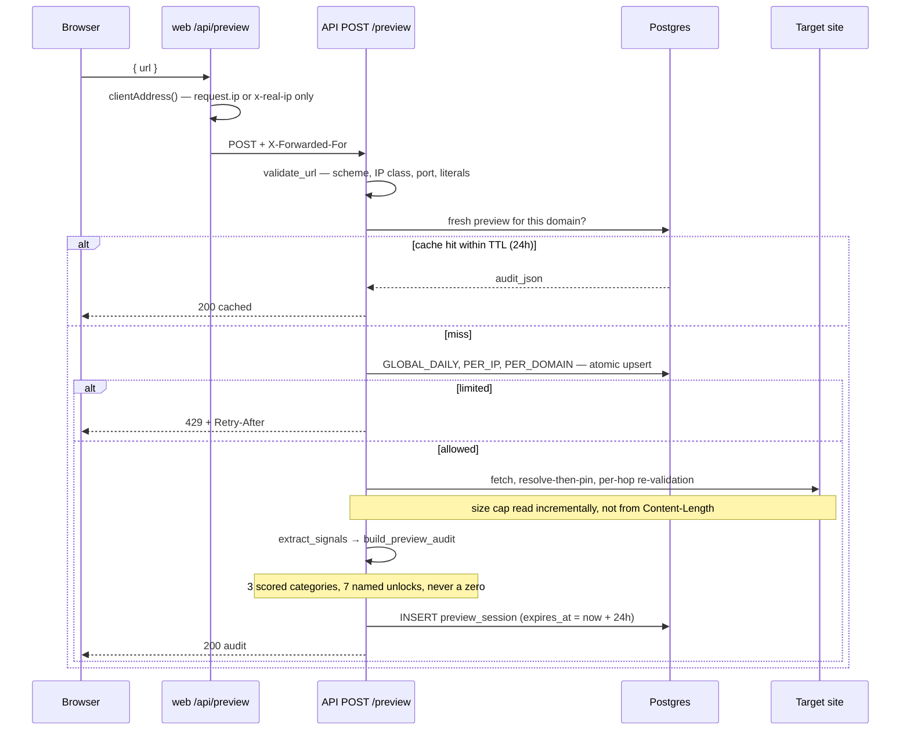
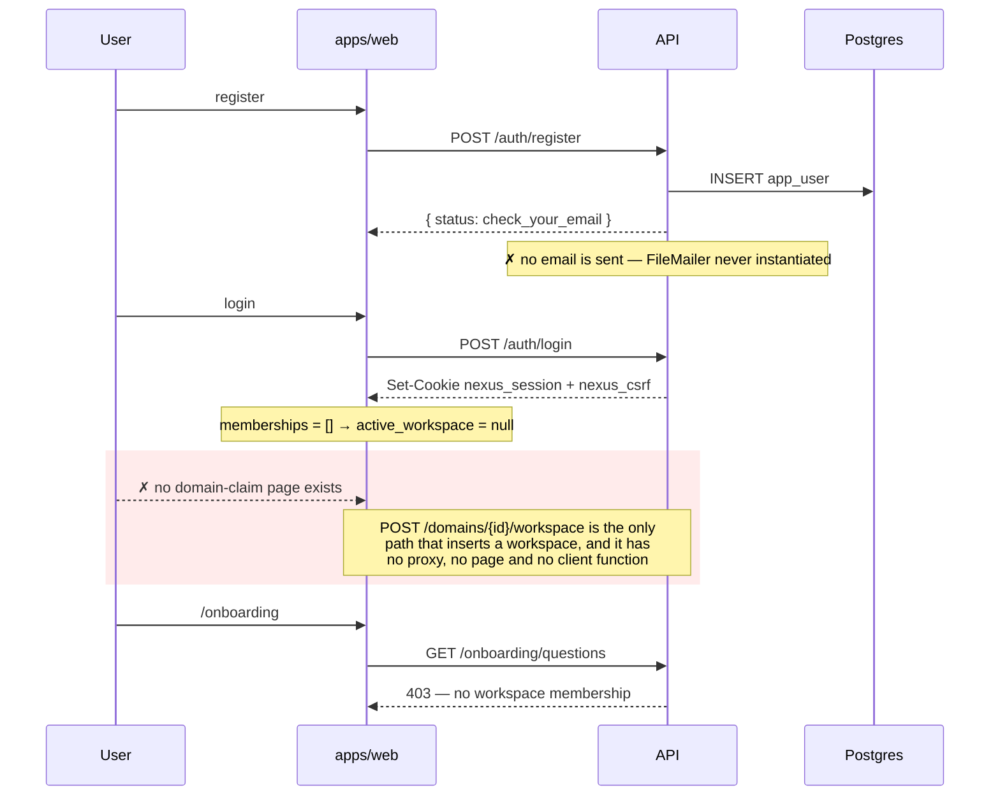
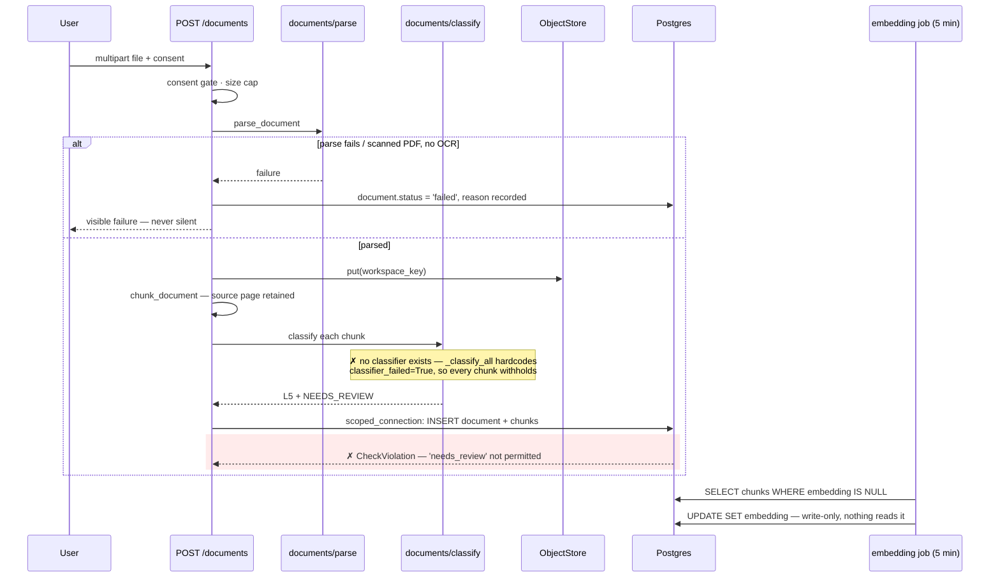
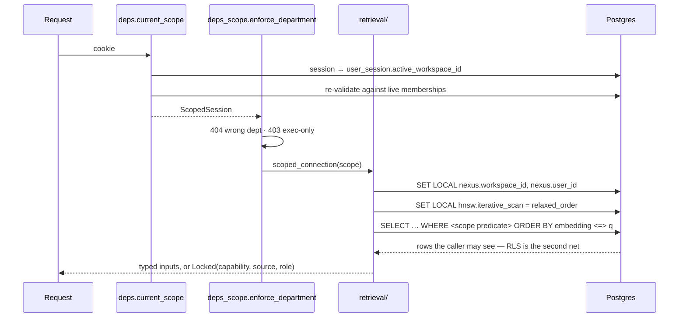

# NEXUS OS — Low-Level Design

**Version:** 1.0 · 25 August 2026 · supersedes `doc/archive/ARCHITECTURE.md`
**Scope:** modules, schema, contracts, sequences and failure paths — what is in the
code today and what the target shape is
**Companion:** `ARCHITECTURE-HLD.md` for system shape and rationale

This document is reconciled against the working tree, not against intent. Where
the code and the design differ, the difference is stated rather than smoothed
over. **● built · ◐ partial · ○ not built**

---

## 1. Repository layout

```
D:\Projects\NEXUS_OS
├── apps/web                       Next.js 14 App Router · TS · Tailwind
│   ├── app/                       9 pages · 13 BFF route handlers
│   ├── components/                48 components (art · auth · dashboard · onboarding · preview · sections · ui)
│   └── lib/                       api-error · auth-client · auth-proxy · dashboard-client
│                                  onboarding-client · hooks · client-address · content
├── services/api
│   ├── app/
│   │   ├── main.py                lifespan · router wiring · docs gating
│   │   ├── config.py              pydantic-settings, NEXUS_ prefix
│   │   ├── db.py                  engine · sessionmaker · _unscoped_session
│   │   ├── deps.py                current_session · current_scope
│   │   ├── deps_scope.py          API-layer scope guards
│   │   ├── health.py              liveness · readiness with 5 probes
│   │   ├── logging.py             structlog · redaction · customer-content refusal
│   │   ├── storage.py             ObjectStore + FilesystemObjectStore
│   │   ├── mail.py                Mailer + FileMailer          ← ○ never instantiated
│   │   ├── auth/                  passwords · tokens · csrf · service · domains
│   │   │                          invitations · email_verification
│   │   ├── domain/                scopes · access · onboarding · invitations
│   │   │                          session · dashboards (67 offering specs)
│   │   ├── retrieval/             scoped.py — the mandated data path       ◐
│   │   ├── calculators/           audit.py — the only calculator           ◐
│   │   ├── connectors/            ssrf · crawler · extract · rate_limit · domain_check
│   │   ├── documents/             parse · chunk · classify · embed
│   │   ├── embeddings/            contracts · registry · providers · fastembed_provider
│   │   ├── ai/                    contracts · registry · providers · anthropic_provider
│   │   ├── jobs/                  scheduler · expiry
│   │   └── routes/                auth · preview · onboarding · documents · setup · dashboards
│   ├── migrations/versions/       0001 … 0009
│   └── tests/                     37 files · 458 test functions
├── db/bootstrap.sql               role creation + NOSUPERUSER/NOBYPASSRLS verification
├── docker/postgres/init/          role bootstrap on an empty volume
├── scripts/                       setup · api · ci · smoke · verify · db-init · db-docker · pg-local
└── doc/                           01–08 specs · adr/ · archive/ · exports/ · prototype/ · source/
```

**Target additions**, per doc 07 §4, none of which exist yet:
`services/api/app/grounding/` (context assembler, schema validation, generation
logging) · `services/api/app/agents/` (agent definitions, MCP tool servers) ·
`packages/schemas/` (JSON Schema generated from Pydantic, consumed as TS types) ·
`evals/` (`permissions`, `grounding`, `injection`).

---

## 2. The scope primitive

### 2.1 `ScopedSession`

```python
@dataclass(frozen=True)
class ScopedSession:
    user_id: UUID
    workspace_id: UUID              # resolved server-side per request, never from client
    tenant_id: UUID
    role: Role
    departments: frozenset[Department]
    max_scope: Scope
    contributor_restricted: bool
    named_l4_item_ids: frozenset[UUID]
    is_executive_surface: bool
    def cache_key(self) -> str: ...
```

Constructed once per request by the `current_scope` dependency, which reads the
session cookie, resolves the active workspace from `user_session`, and
re-validates it against live memberships. **No header, query parameter or body
field can set the workspace.**

`test_retrieval_signatures.py` walks every public callable in `app.retrieval` and
fails the build on an identity argument, with a self-test proving the guard can
fail.

### 2.2 Enums

```python
class Scope(IntEnum):          # ordered, so >= comparisons are meaningful
    L1_COMPANY_PUBLIC = 1
    L2_COMPANY_INTERNAL = 2
    L3_DEPARTMENT = 3
    L4_RESTRICTED = 4
    L5_PERSONAL = 5

class Department(StrEnum):
    MARKETING · SALES · FINANCE · OPERATIONS · HR · STRATEGY · EXECUTIVE

class Role(StrEnum):
    OWNER · EXECUTIVE · DEPARTMENT_MANAGER · CONTRIBUTOR · VIEWER · EXTERNAL
```

`scope_code(Scope.L3_DEPARTMENT) -> "L3"` translates for the CHECK constraints.
It lives beside the enum so two copies of the spelling cannot drift — **and this
is exactly the drift that bit `ReviewState`, which has no such function** (§4.4).

### 2.3 `scoped_connection` — the mandated data path

```python
@asynccontextmanager
async def scoped_connection(scope: ScopedSession) -> AsyncIterator[AsyncSession]:
    async with sessionmaker() as session, session.begin():
        await session.execute(
            text("SELECT set_config('nexus.workspace_id', :ws, true),"
                 "       set_config('nexus.user_id', :uid, true)"),
            {"ws": str(scope.workspace_id), "uid": str(scope.user_id)},
        )
        yield session
```

`is_local = true` is load-bearing: the GUCs are transaction-scoped, so a pooled
connection returned to the pool carries no residue from the previous caller.
Both GUCs are set in one round trip.

**Current reality:** 8 call sites, all in `routes/documents.py` and
`routes/setup.py`. Four other modules set the same GUCs by hand —
`auth/domains.py`, `auth/invitations.py` (×2), `auth/service.py` — so there are
**five implementations of one primitive** and no lint rule forbidding a sixth.
`_unscoped_session`, documented as infrastructure-only, has 25+ route call sites.
Consolidation is `M8` in `BUILD-STATUS.md`.

### 2.4 API-layer guards — `deps_scope.py`

| Function | Behaviour | Used by a route? |
|---|---|---|
| `enforce_department` | 404 for another department; 403 for executive-only | ● `routes/dashboards.py` |
| `guard_aggregate` | Contributor denied a department-wide aggregate | ○ tests only |
| `guard_record` | Denied another user's record | ○ tests only |
| `filter_records` | Post-filter helper | ○ tests only |
| `Locked` | The disclosable response type | ○ tests only |

**Three of five guards have no production caller.** They were forward-built for
M6 and are correct; they simply have nothing to guard until the retrieval layer
exists.

---

## 3. Retrieval — the query shapes

**Status ○.** No retrieval query exists. These are the target shapes, and they
are specified here because getting them wrong is unrecoverable.

### 3.1 Vector

```sql
SET LOCAL hnsw.iterative_scan = relaxed_order;   -- ADR 0012: 5% recall without it

SELECT id, content, document_id, source_page, source_label
FROM chunk
WHERE workspace_id = :ws                          -- RLS also enforces this
  AND review_state IN ('auto_approved', 'approved')
  AND (
        scope IN ('L1','L2')
     OR (scope = 'L3' AND department && :depts
                      AND NOT (:restricted AND is_dept_aggregate))
     OR (scope = 'L4' AND id = ANY(:named_l4))
     OR (scope = 'L5' AND owner_user_id = :uid)
      )
ORDER BY embedding <=> :query_vector
LIMIT :k;
```

Three properties this shape must keep:

1. **The predicate is in the `WHERE`, not applied after.** An external vector store
   forcing post-filtering would break I3, which is why doc 07 §3 forbids one.
2. **`iterative_scan` is set per transaction, not globally.** ADR 0012 measured a
   plain HNSW index at **5% recall** at the selectivity of a Contributor reading
   their own rows, and found `ef_search` rescues a department-sized filter while
   leaving narrow ones broken. Partial indexes per scope are **not** needed.
3. **`is_dept_aggregate` is part of the predicate**, which is why it is a column.
   It is currently written by nothing and read by nothing.

### 3.2 Relational

RLS gives tenant and workspace isolation only. Every operational table
additionally carries `department` and `sensitivity`, and every repository read
applies the same predicate. A widget resolver that cannot satisfy its inputs
inside the caller's scope returns **`Locked`** — it never computes over hidden
rows and returns only the total.

### 3.3 The split that reconciles "pure calculators" with "calculators receive the scope set"

- **`retrieval/`** takes `ScopedSession`, does the IO, applies the predicate, and
  returns typed inputs **or** a `Locked(reason)` sentinel.
- **`calculators/`** is pure. Takes those typed inputs, returns
  `(value, CalculationTrace)`. No IO, no clock, no randomness.
- A thin **widget resolver** in the application layer composes the two and maps
  `Locked`/`Warming`/`Stale` onto render states.

Both doc 07 §4 and doc 06 §4.7 hold, across two objects.

---

## 4. Database design

PostgreSQL 18.4 + pgvector 0.8.6 on Neon, connecting as `nexus_app`
(`NOSUPERUSER NOBYPASSRLS`). Never as `neondb_owner`, which has
`rolbypassrls = true` and would render every policy inert while the whole suite
kept passing. `db/bootstrap.sql` verifies both flags and raises if either is true,
because Neon rejects `ALTER ROLE … NOSUPERUSER` outright — tolerate the statement,
prove the outcome.

### 4.1 Migration chain

Linear, single head, no branches. `0001 → 0002 → … → 0009`.

| Rev | Adds |
|---|---|
| 0001 | `pgcrypto` (hard) · `vector` if available, `NOTICE` if not |
| 0002 | `tenant` `app_user` `workspace` `membership` `user_session` `persona` `audit_log`; **ENABLE + FORCE RLS** on 4 |
| 0003 | `membership_own_rows` SELECT policy — the workspace switcher lists your own memberships |
| 0004 | `preview_session` `rate_limit_counter` (no RLS — pre-account) |
| 0005 | `email_verification` `domain_claim`; `workspace.owner_claim_review`, `.verification_method` |
| 0006 | `onboarding_answer` `invitation`; RLS on both |
| 0007 | `document` `chunk` + **hard-requires `vector`**; RLS on both; HNSW index |
| 0008 | `workspace_own_memberships` SELECT policy — login can find your workspaces |
| 0009 | `invitation_by_token_hash` SELECT policy — accept by token without a workspace |

`migrations/env.py` sets `target_metadata = None`, so **autogenerate drift
detection does not exist**. CI runs no migration at all. Those two facts together
are why §4.4's constraint violations reached `main`.

### 4.2 RLS policies

Eight tables carry `ENABLE` + `FORCE ROW LEVEL SECURITY`: `workspace`,
`membership`, `persona`, `audit_log`, `onboarding_answer`, `invitation`,
`document`, `chunk`.

```sql
-- On all eight, FOR ALL, both USING and WITH CHECK:
workspace_id = NULLIF(current_setting('nexus.workspace_id', true), '')::uuid
```

Plus three narrow SELECT-only policies that exist because the isolation policy
alone makes login impossible:

| Policy | Table | Predicate | Why |
|---|---|---|---|
| `membership_own_rows` | `membership` | `user_id = nexus.user_id` | list your own memberships |
| `workspace_own_memberships` | `workspace` | live membership exists for `nexus.user_id` | login cannot set the workspace GUC — which workspace is what it is trying to find out |
| `invitation_by_token_hash` | `invitation` | `token_hash = nexus.invitation_token_hash` | accept an invitation with no workspace context |

**No RLS:** `tenant`, `app_user`, `user_session` (global identity, by design) and
`preview_session`, `rate_limit_counter`, `email_verification`, `domain_claim`
(pre-account). **`domain_claim` is the problem case** — it carries `workspace_id`
and `disputes_workspace_id`, is the most-queried table in the codebase, and has no
policy. Tracked as `H7`.

### 4.3 The two load-bearing tables

**`chunk`** — where a classification mistake becomes a permanent silent breach.

```
id · workspace_id · document_id · ordinal · content
source_page · source_label                      ← citations depend on these
scope                CHECK IN ('L1'…'L5')
department           text[]  + GIN index        CHECK L3 ⇒ length ≥ 1
owner_user_id                                   CHECK L5 ⇒ NOT NULL
sensitivity          CHECK IN ('normal','financial','personal','restricted')
classified_by · confidence  CHECK 0..1
review_state         CHECK IN ('auto_approved','pending_review','approved','rejected')
is_dept_aggregate    boolean                    ← written by nothing, read by nothing
embedding            vector(1024)
embedding_model_id · embedding_dim · embedded_at
                     CHECK ck_chunk_embedding_provenance
```

Indexes: `ix_chunk_embedding_hnsw` (`hnsw (embedding vector_cosine_ops)`,
`m=16, ef_construction=64`) · `ix_chunk_pending_review` (partial, on
`review_state='pending_review'`) · `ix_chunk_scope` · `ix_chunk_department` (GIN).
**All four are written to and none is ever read**, because no retrieval query
exists.

**`generation`** — ○ not built. It is what lets any card answer *"why are you
telling me this?"* (I9). `input_snapshot` will be a second copy of customer
content and inherits its inputs' scope tag and retention.

### 4.4 Two constraint violations sitting in `main`

Both are certain runtime failures, and both are Phase 1 work (`C1`, `C2`).

| # | Where | Problem |
|---|---|---|
| 1 | `documents/classify.py` `ReviewState` vs `0007` `ck_chunk_review_state` | Python emits `needs_review · human_approved · quarantined`; SQL permits `pending_review · approved · rejected`. Only `auto_approved` overlaps. `routes/documents.py:336` inserts `.value` directly, and `_withhold` always returns `NEEDS_REVIEW` — so **every chunk of every upload violates the CHECK and the transaction rolls back**. The review queue then filters on `'pending_review'`, which nothing writes |
| 2 | `routes/documents.py:347` | `UPDATE document SET status = 'superseded'` — not in `ck_document_status`. Any upload carrying `supersedes_id` fails |

Neither was caught because `tests/test_document_upload.py:64` monkeypatches
`_record`, and **no test anywhere inserts a chunk against a real database**.

### 4.5 Dead schema

`persona` (10 columns, unique constraint, RLS policy) and `audit_log` (9 columns,
index, RLS policy) have **zero SQL references in `services/api/app`**. Dead
columns: `chunk.is_dept_aggregate`, `document.retention_until`,
`audit_log.impersonated_user_id`.

### 4.6 Connection management

```python
create_async_engine(url,
    pool_pre_ping=True, pool_size=5, max_overflow=5, pool_recycle=300)

# transaction-mode pooler branch — triggered by "-pooler" in the hostname
poolclass=NullPool, statement_cache_size=0, prepared_statement_cache_size=0
```

**No timeouts of any kind** — no `statement_timeout`, `lock_timeout`,
`idle_in_transaction_session_timeout`, `connect_timeout`, `command_timeout`, or
explicit `pool_timeout`. Ten hung queries deadlock the process. The
`iterative_scan` retrieval path in §3.1 is exactly the unbounded-work query that
needs a statement timeout before it ships. Tracked as `C12`.

The pooler branch matching on the literal `"-pooler"` is fragile: a PgBouncer at
any other hostname keeps prepared-statement caching on and fails intermittently.

---

## 5. API contracts

25 endpoints across 7 routers, all wired in `main.py`. `require_csrf` guards
every state-changing route that has a session.

### 5.1 Public — no session

| Method | Path | Notes |
|---|---|---|
| `GET` | `/health` | ● liveness, touches nothing |
| `GET` | `/health/ready` | ● 5 probes: DB+pgvector (one query), storage write, LLM, embedder. 503 when a `required_now` check fails. Leaks no DSN |
| `POST` | `/preview` | ● the most complete endpoint. SSRF validate → cache lookup → 3 rate-limit counters → pinned crawl → extract → `build_preview_audit` → persist. No `GET /preview/{id}` exists |
| `POST` | `/auth/register` | ◐ creates the user; **sends no email** |
| `POST` | `/auth/login` | ● mints a fresh session, sets `nexus_session` (HttpOnly) + `nexus_csrf` (readable). Auto-selects a workspace only when there is exactly one membership. **No rate limit** |
| `POST` | `/auth/verify-email` | ○ reachable, but no token can exist |

### 5.2 Session required

| Method | Path | Guard | Notes |
|---|---|---|---|
| `POST` | `/auth/logout` | csrf | ● revokes and clears both cookies |
| `POST` | `/auth/workspace` | csrf | ◐ validates against live memberships, then `_teardown_on_switch` — **a single `log.info`** |
| `GET` | `/auth/session` | — | ● memberships + active workspace, no workspace required |
| `POST` | `/domains` | csrf | ● starts a claim; rejects free-email domains |
| `POST` | `/domains/{id}/check` | csrf | ◐ DNS TXT and file-at-path work; EMAIL method dead |
| `POST` | `/domains/{id}/workspace` | csrf | ● **the only path that inserts a workspace** |
| `POST` | `/invitations/accept` | csrf | ● unscoped session; sets the active workspace |

### 5.3 Workspace scope required (`CurrentScope`)

| Method | Path | Guard | Notes |
|---|---|---|---|
| `GET` | `/auth/me` | — | ● same payload as `/auth/session` but requires a workspace |
| `GET` | `/onboarding/questions` | — | ● 13-question catalogue, per-answer read filter, roster for administrators only |
| `POST` | `/onboarding/answers` | csrf | ● 8 answer types validated, scope assigned by `scope_for_answer`, upsert |
| `POST` `GET` | `/invitations` | csrf on POST | ● administrators only; returns `accept_path` carrying the raw token |
| `POST` | `/invitations/{id}/revoke` | csrf | ● 404 if nothing changed |
| `POST` | `/documents` | csrf | ◐ **fails at the chunk insert** — §4.4 |
| `GET` | `/documents/review-queue` | — | ◐ correct, but filters a value nothing writes |
| `POST` | `/documents/review-queue/{chunk_id}` | csrf | ◐ guarded update; `rowcount == 0` → 404. Zero tests |
| `GET` | `/dashboards` | — | ● filtered by reach; `delivered_count` always 0 |
| `GET` | `/dashboards/{department}` | — | ● 403 exec-only, 404 wrong department, all offerings with computed state |

**Missing endpoints the product needs:** document list, signed download, member
management, password reset, workspace deletion, data export, third-party preview
deletion (`delete_previews_for_domain` exists with no caller).

### 5.4 The web BFF layer

13 route handlers under `apps/web/app/api`, all `force-dynamic`. All but
`/api/preview` and `/api/health` go through `proxyToApi`, which forwards `Cookie`
and `X-CSRF-Token` up and `Set-Cookie` down via `getSetCookie()`. Every body is
field-allowlisted; the `[department]` segment is checked against the seven keys
before interpolation.

**Ten backend endpoints have no proxy**, and three of them are the gap that makes
the authenticated product unreachable: `POST /domains`, `/domains/{id}/check`,
`/domains/{id}/workspace`. Also unproxied: `POST /auth/workspace`, both document
routes, the review queue, `/auth/verify-email`.

`/api/preview` deliberately bypasses `proxyToApi` to derive `X-Forwarded-For` from
`request.ip` / `x-real-ip` — neither settable by a browser — after a defect where
the browser's own header was forwarded verbatim and made the per-IP limit
bypassable.

---

## 6. Key sequences

### 6.1 Preview audit — the one complete flow ●



### 6.2 Signup to workspace — the broken flow ◐



**Everything after login is unreachable.** Phase 2 (`C3`) closes this.

### 6.3 Document ingestion — target vs actual



### 6.4 Scoped read — target ○



---

## 7. Failure paths

Doc 07 M5's rule generalised: **a failure is visible or it is a defect.**

| Failure | Handling | Status |
|---|---|---|
| Parse failure / scanned PDF, no OCR | `document.status='failed'` with a reason; surfaced to the uploader | ● |
| Classification failure or below `CONFIDENCE_THRESHOLD` (0.85) | L5 + review queue via the single `_withhold` path | ● gate ◐ storage |
| `sensitivity: personal \| restricted` | Human confirmation required regardless of confidence — a payroll export the classifier is 99% sure about is precisely the one that must not auto-publish | ● |
| SSRF refusal, rate limit, crawl timeout | Typed error to the client; `Retry-After` on 429 | ● |
| Embedder absent | `embeddings: unconfigured` at readiness; chunks stored with NULL embedding, permitted by `ck_chunk_embedding_provenance`; documents upload and classify, they are simply not searchable | ● |
| Model absent | `language_model: unconfigured`; `UnavailableProvider` refuses when called. **No demo mode** — a fabricated recommendation destroys the product's central claim whether or not it is labelled, because the label stays on screen and the screenshot does not | ● |
| Schema validation fails after one retry | Render **Unavailable** — never a cheaper unevaluated model, never a stale cache | ○ |
| Unhandled exception | **No global handler; `x-request-id` dropped** — every 500 is uncorrelatable | ○ `H10` |
| Web render crash | `app/error.tsx` shows the digest, not the message, because a render error can carry customer content | ● |

**Two anti-fabrication rules, and the asymmetry between them.** `ScriptedProvider`
raises on an unscripted skill; `DeterministicEmbedder` is hash-derived, is never
returned by the registry, and no setting can select it. The embedding rule is
stricter on purpose: a scripted provider refuses and fails loudly, whereas a fake
embedding *ranks* — it produces confident citations beside a real answer with no
visible symptom at all.

---

## 8. Configuration

`pydantic-settings`, prefix `NEXUS_`, `.env` at the repo root, `extra="ignore"`
(so unknown `NEXUS_*` variables are silently discarded).

| Group | Settings |
|---|---|
| Environment | `env` `debug` |
| Database | `database_url` |
| Session | `session_secret` ✗dead · `session_cookie_name` · `session_max_age_seconds` (12 h) |
| Storage | `storage_backend` · `storage_root` · `storage_signing_secret` · `signed_url_ttl_seconds` ✗dead |
| Mail | `mailer_backend` ✗dead · `mail_root` ✗dead |
| Embeddings | `embedding_model_id` · `embedding_dim` (1024) · `model_cache_dir` ✗dead · `embeddings_enabled` |
| AI | `anthropic_api_key` · `anthropic_model` · `ai_enabled` · `disabled_ai_skills` |
| Budgets | `tenant_daily_token_budget` ✗dead · `user_daily_token_budget` ✗dead |
| Network | `trusted_proxy_ips` |
| Crawl | `preview_ttl_hours` (24) · `crawl_max_bytes` · `crawl_timeout_seconds` · `crawl_max_redirects` |

**Seven settings are declared and read by nothing.** `session_secret` is the worst
of them: required in `.env.example`, pinned in `conftest.py`, and referenced by no
line of code — dead config presenting as a security control.

**`require(name)`** raises when a secret is empty. `anthropic_api_key` deliberately
bypasses it, because an absent model is a supported state, not a
misconfiguration.

**`_required_in_deployed_envs`** is decorated over `database_url`,
`session_secret` and `storage_signing_secret`, and its body is `return v`. It
enforces nothing. Combined with `env` defaulting to `local` — and `is_local` also
covering `ci` — a missing `NEXUS_ENV` in production serves `/docs` and sets
`secure=False` on both cookies. `C7` and `C8`.

`embedding_dim` is duplicated in `config.py` and in migration `0007`, with nothing
asserting they agree.

---

## 9. Jobs

APScheduler inside the API process, started in `main.py`'s lifespan only when
`database_url` is non-empty.

| Job | Interval | Does |
|---|---|---|
| `expiry_sweep` | 60 min | Hard-deletes expired `preview_session` rows (an obligation to a third party who never consented to the crawl), expires stale `domain_claim` rows, purges `rate_limit_counter` |
| `embedding_pass` | 5 min | Embeds chunks with a NULL embedding, writing provenance columns; idempotent via `WHERE embedding IS NULL` |

**Every API process runs the scheduler**, stated in the module docstring with the
threshold at which that stops being acceptable. The sweep is idempotent.
`test_scheduler.py` asserts every job has a **fire time**, not merely that it is
registered — a regression guard added after the sweep shipped permanently paused
by `next_run_time=None` while startup logged `scheduler.started`.

**Before production:** the embedding pass moves to its own worker (`M15`). Once
`[embeddings]` is installed, ~2 GB of model weights are resident in the process
serving requests.

---

## 10. Testing strategy

**458 test functions across 37 files** (≈642 collected with parametrisation).
`pytest` with `asyncio_mode=auto` and `filterwarnings=["error"]`; `mypy --strict`
over `app`; `ruff` with `E,F,W,I,N,UP,B,A,S,T20,RUF`.

### 10.1 The rule

Write the test that proves the invariant **before** the feature it guards, for
anything touching permissions or grounding. The suite has honoured this — the
89-case SSRF corpus preceded the crawler, the 12 isolation tests preceded the
tenancy migration, and the 27 Contributor cases preceded the boundary.

### 10.2 What is proved, and where it is not

| Category | State |
|---|---|
| Security primitives — SSRF, RLS, CSRF, roles, Contributor boundary | ● strong |
| Calculators, parsing, classification gate, vendor boundaries | ● strong |
| **Frontend** | ○ **zero tests.** No Vitest, no Jest, no Playwright — which doc 07 §3 requires |
| **Eval suites** | ○ none of `/evals/{permissions,grounding,injection}` exists |
| **HTTP handlers in `routes/setup.py`, `routes/onboarding.py`** | ○ domain functions tested, handlers never driven through the app |
| **`auth/domains.py`, `domain/invitations.py`, `mail.py`, `jobs/expiry.py`** | ○ untested |
| **Review queue** | ○ zero tests on either endpoint |
| **Coverage** | ○ never measured — no `pytest-cov`, no floor |

### 10.3 Three known weaknesses

1. **Self-referential mirrors.** `test_expiry.py` is a *"synchronous mirror of
   `expire_previews`"*; `test_rate_limit.py` mirrors `check_and_increment`;
   `test_tenant_isolation.py` sets the scoping GUCs in raw SQL rather than through
   `scoped_connection`. Each tests a re-implementation, so the production SQL can
   be edited without a failure. `H9`.
2. **CI runs none of the database tests.** No Postgres service, no
   `NEXUS_DATABASE_URL` — so 92 tests skip, including the entire isolation suite.
   They pass *locally* because `tests/dburl.py` falls back to the repo `.env`, so
   the security evidence exists on one machine. `C5`.
3. **Monkeypatched writes.** `test_document_upload.py` patches `_record`, which is
   why two constraint violations survived twelve tests over that route.

### 10.4 Hermeticity

`conftest.py` is autouse and blanks `NEXUS_DATABASE_URL`, `NEXUS_SESSION_SECRET`,
`NEXUS_STORAGE_SIGNING_SECRET` and `NEXUS_ANTHROPIC_API_KEY`, sets `NEXUS_ENV=ci`,
and redirects storage and mail roots to a tmp path. This exists because a real
value in `.env` once changed the suite's *result* — worse than a failing test,
because it passes in CI and fails on the machine that wrote it. The Anthropic key
was the last one added, after a test had to accept `state in {"ok",
"unconfigured"}` to pass anywhere; that tolerance was the symptom.

`test_hermeticity.py` is the regression guard.

---

## 11. Frontend design

Next.js 14 App Router. **Server components render shells; client components own
state.** Every API call goes through a BFF route handler, so the browser never
holds a token and the API is never exposed directly.

```
app/layout.tsx           root, skip link, metadata
├── page.tsx             ● landing — 14 static sections + live PreviewForm
├── login · register     ● AuthShell + client forms
├── account              ● AccountPanel ← GET /api/auth/session
├── onboarding           ● OnboardingWizard ← questions/answers, TeamStep for invites
├── invitations/accept   ● AcceptInvitation ← ?token
├── dashboard            ● DashboardLanding ← GET /api/dashboards, redirects
├── dashboard/[dept]     ● DirectorPage ← GET /api/dashboards/{dept} — 67 tiles, no metrics
├── error.tsx            ● digest only, never the message
└── not-found.tsx        ●
```

**Missing routes:** `loading.tsx` (none anywhere), `global-error.tsx`,
`middleware.ts`, and any nested layout — so all four authenticated pages
re-implement their own header.

**Data discipline.** `lib/content.ts` holds all landing copy. Every fabricated
figure carries a visible `Illustrative` tag, per the CLAUDE.md content rule. The
one unlabelled overclaim is the capability lists — 35 named features against
`DELIVERED = frozenset()`.

**Boundary validation is the weak point.** Four `as` casts at API boundaries
(`auth-client`, `dashboard-client`, `onboarding-client`) in the same codebase
where an unvalidated boundary value already produced a white screen — a FastAPI
validation error returns an *array of objects* where a `string` was assumed.
`lib/api-error.ts` fixed the specific case; the general one is `M10`, and `zod`
against `packages/schemas` is the intended answer.

---

## 12. Conventions

**PowerShell 5.1 is the shell.** No `&&`, no `||`, no ternary, no `??`. Commands
are copied and pasted, so a bash-ism is a broken command. Prefer handing over a
script — `scripts\ci.ps1`, `scripts\verify.ps1`, `scripts\db-init.ps1` exist so
nothing has to be composed by hand. Native stderr becomes a terminating error
under `$ErrorActionPreference='Stop'`, so branch on `$LASTEXITCODE` around
`alembic` and `psql`.

**Docker lives inside WSL2**, not on the Windows PATH — route every call through
`scripts/lib/docker.ps1`.

**Comments state intent, and the intent is tested.** In four separate defects the
comment was correct and the code diverged from it — the paused scheduler, the
no-op config validator, the crawler budget, the health storage branch. That is a
good failure mode to have and an argument for testing the claims comments make.

**Stop the web dev server before `ci.ps1`.** Both write `apps\web\.next`, and a
concurrent `next build` fails with `PageNotFoundError`.
