# NEXUS OS — The New Application Flow

**Status:** design, awaiting Parul's ratification · **Version:** 1.0 · 25 August 2026
**Source:** Parul's handwritten flow sketch, 25 August 2026
**Supersedes on ratification:** doc 06 §0 (the six onboarding stages) · doc 04 §5 (the seven-stage redesign)
**Resolves:** **D17** in favour of doc 08 · **D15** as *yes, member onboarding is per-department*

---

## 1. The sketch, transcribed

```
Landing Page
      ↓
Login / Sign Up
      ↓
Register
      ↓
We will Register a Company
      ↓
Ask all questions about Company, website.
Get the department selected.
      ↓
Onboard documents
      ↓
Add Tools across all departments — together
      ↓
Do a full Research and create a Company Brain
The Brain is the core part
      ↓
Dashboard  ──▶  Then can add there members
```

Nine steps, one line, no branches. The absence of branches is the point.

---

## 2. What this changes

| | Old flow (doc 06 §0, as built) | New flow |
|---|---|---|
| **Entry** | URL capture → free Preview audit, **before any account** | Sign up first. No unauthenticated product |
| **Company creation** | After email verification **and** domain verification | Immediately after register |
| **Domain verification** | **The gate on workspace existence** | Not in the sketch — see §4.1 |
| **Questions** | Pass 1 (role, dept, purpose, URL) → audit → Pass 2 (eight more) | One block: company + website + **which departments the company runs** |
| **Departments** | Derived from the founder's own role | **Explicitly selected** — decides which directors exist |
| **Documents** | A later feature (M5), not a flow stage | An explicit onboarding stage |
| **Tools / integrations** | Late (M10), prompted per department from a Locked tile | **Early, all departments on one screen** |
| **Company Brain** | Assembled after onboarding (M7), implicit | **An explicit stage, and the gate on the dashboard** |
| **Team members** | Invited during onboarding, "team last" | **After the dashboard exists** |
| **First value** | The audit, at minute seven | The Brain and its review gate |

---

## 3. Analysis — what the sketch gets right

**It confronts the cold-start problem instead of decorating it.** Doc 04's central
finding was that none of the headline dashboard numbers exist on day one. The old
flow's answer was honest empty states. The new flow's answer is better: *do not
open the dashboard until the Brain is built.* Every stage before the dashboard now
exists to feed it, and the dashboard is a reward rather than a disappointment.

**It makes the moat the visible centre of the product.** "The Brain is the core
part" is written on the page. In the old flow the Brain was an internal
implementation detail the user never met. Here they watch it being built, then
correct it — and a user correcting a fact is the single highest-value input the
system receives.

**"Tools across all departments together" fixes a real failure mode.** Connecting
GA4 from a Locked Marketing tile means the user connects nothing, because they
have not yet seen why it matters. One screen listing every source against the
capabilities it unlocks — *connect GA4, get four Marketing widgets and two
Strategy widgets* — converts far better, and it is the natural place for doc 05
§9's field-completeness check.

**Members after the dashboard is the right order.** Inviting colleagues into an
empty product wastes the invitation. Inviting them into a built Brain means the
founder can show them something. It also puts the invitation flow exactly where
domain verification naturally belongs (§4.1).

**One linear path is far cheaper to build and test than two.** The old flow had an
unauthenticated product and an authenticated one, with different rate limits,
different data retention and different threat models. Collapsing that removes a
whole class of work.

---

## 4. Analysis — the four problems the sketch must resolve

### 4.1 The domain-verification collision — the one real conflict

You confirmed that *"a verified domain gates workspace creation"* still holds. The
sketch creates the company immediately after register. In the code these cannot
both be true:

```python
# app/auth/domains.py:229 — create_workspace_for_claim, the ONLY insert path
if claim.state != "verified" or claim.verified_at is None:
    raise DomainClaimError("Verify the domain before creating a workspace.")
```

A DNS TXT record takes minutes to hours to propagate. Putting that in the middle of
a linear signup flow means the user stops at step 4 and comes back tomorrow — which
kills the flow the sketch is designed around.

**Recommended resolution: move the gate, keep the guarantee.** Verification stops
gating *whether a workspace exists* and starts gating *what the workspace may do.*

| Capability | Unverified | Verified |
|---|---|---|
| Register the company, answer questions, upload documents | ✅ | ✅ |
| Build the Brain from your own uploads and answers | ✅ | ✅ |
| Crawl and audit the claimed domain | ✅ *(public data, rate-limited)* | ✅ |
| Exclusive claim on the domain — nobody else may claim it | ❌ | ✅ |
| **Invite team members** | ❌ | ✅ |
| Connect a tool that holds company data (GA4, CRM) | ❌ | ✅ |
| Appear to anyone outside your own account | ❌ | ✅ |

This preserves what the invariant is *for* — nobody occupies a domain they do not
own, and nobody invites strangers into a company they do not control — while
letting a founder get to a Brain in one sitting. It also lands the gate precisely
where the sketch already puts invitations: after the dashboard.

**Cost:** small. `workspace.domain_verified_at` is already nullable, and the
partial unique index already implements first-verified-wins on the verified rows
only. The change is to relax one precondition in `create_workspace_for_claim`,
split it into `create_workspace` and `attach_verified_claim`, and add the
verification check to the invitation and connector paths.

**Alternative if you want the strict gate:** keep verification before company
creation, but make same-domain email the default path — it verifies in seconds
rather than hours. That requires email delivery (C10) and accepts a *weak* proof
that flags `owner_claim_review`. It keeps the invariant literally, at the cost of
a weaker claim on the domain.

### 4.2 The free Preview audit disappears — and 90% of it survives anyway

The audit is the most finished thing in the codebase: the SSRF guard with 89 test
cases, the pinned crawler, the extractor, the three scoring calculators, the
Postgres rate limiter, the preview cache. It is also the only flow that works end
to end today.

**Almost none of that is wasted, because "do a full Research" needs all of it.**
The engine is reused; only the unauthenticated entry point is in question:

| Component | Fate under the new flow |
|---|---|
| `connectors/ssrf.py` | **Survives, load-bearing** — research crawls a user-supplied URL |
| `connectors/crawler.py` | **Survives, extended** — `fetch_page` is single-page; research needs multi-page |
| `connectors/extract.py` | **Survives** — the same signals feed the Brain |
| `calculators/audit.py` | **Survives** — brand, SEO and performance scores become the dashboard's first real numbers |
| `connectors/rate_limit.py` | **Survives** — still needed per-workspace on the research path |
| `preview_session` table + cache | Only needed if the pre-signup audit stays |
| The landing URL-capture form | **This is the decision** — see **D18** |

**Recommendation:** keep a URL field on the landing page, but as a *lead-in to
signup*, not a product. The visitor enters their URL, we start the crawl
immediately, and the sign-up form appears with the crawl already running in the
background. By the time they finish registering, the research on their website is
partly done. That converts better than either alternative and reuses the whole
engine.

### 4.3 "Do a full Research" is one line and the largest thing in the plan

Unpacked, that stage is:

1. Multi-page crawl of the company site — home, about, services, pricing, contact, blog index
2. Brand, SEO and performance scoring on what it finds *(exists)*
3. Competitor discovery *(needs a SERP source)*
4. Keyword volumes *(needs DataForSEO — **D2**)*
5. Reading every uploaded document into chunks and facts *(parsing exists, the classifier does not)*
6. A first pull from any connected tool *(needs M10)*
7. Fact assembly with provenance on every fact
8. Conflict resolution: user-confirmed > connected system > crawl > inference
9. **The review gate** — every inferred fact, grouped, with its source and an edit control

That is doc 07's M2, M5, M7 and part of M10 in a single user-facing step. It is
also **long-running** — minutes, not seconds, and some sources will fail while
others succeed.

**Architecturally this is the biggest new requirement in the sketch:** the product
now needs a real job model. Today there is an in-process APScheduler with two
fixed-interval jobs and **no job or progress table at all**. The research stage
needs `research_run` and `research_source` rows with per-source status, a worker
that is not the API process, and a progress UI that shows *this succeeded, this
failed, this is still going* rather than a spinner.

**Two things follow.** First, the Brain must be usable from partial results — if
keyword data fails, the Brain ships without keyword facts and says so. Second, the
research stage must be resumable, because a founder will close the tab.

### 4.4 The review gate is missing from the sketch, and it is the value moment

The sketch goes Brain → Dashboard. Doc 06 requires a review gate: every inferred
fact shown with its source, editable, plus a distinct block of assumptions
requiring confirmation.

**It should be added, and not as a chore.** It is the moment the user discovers the
product understands their business — the new equivalent of the old audit at minute
seven. It is also the mechanism by which corrections enter the Brain, which is the
compounding asset. Skipping it means the Brain is built entirely from inference,
and the first wrong fact on the dashboard costs more trust than the review screen
would have cost in time.

**Recommendation:** the research stage *ends* in the review gate. It is not a
separate stage the user can skip; it is how the research stage completes.

---

## 5. What the sketch settles

**D17 — where doc 08 sits.** The sketch matches doc 08 §0 almost word for word:
*"The workspace owner selects which departments the company runs and answers those
departments' questions. An invited team member answers only their own department's
set."* "Get the department selected" is doc 08's departments multi-select, which
does not exist in doc 06's catalogue. **Reading: doc 08 outranks doc 06 §2.5 on the
question set and the department model.**

**D15 — member onboarding.** Answered yes, per-department, for invited members —
and the sketch's placement of invitations after the dashboard resolves the third
of D15's open questions (what happens on a department change) by making the flow
re-runnable per member rather than once per company.

**Consequence for the code:** `app/domain/onboarding.py`'s 14-question catalogue is
company-wide and its `department` field tags *which department owns an answer as an
L3 fact* — not who is asked. The new model needs both: a company block, and a
per-department block keyed to the selected departments. The catalogue is data and
the wizard renders from it, so this is an extension rather than a rewrite.

---

## 6. The new flow, complete

### 6.1 The shape

```mermaid
flowchart TD
    A["<b>0 · Landing page</b><br/>marketing · one action: get started<br/>optional URL field starts the crawl early"] --> B

    B["<b>1 · Sign up / Log in</b><br/>email + password · session cookie<br/>verification email sent, non-blocking"] --> C

    C["<b>2 · Register the company</b><br/>name · website · country · currency · size<br/>creates tenant + workspace + owner membership<br/>domain recorded as claimed, unverified<br/><i>▶ background crawl starts here</i>"] --> D

    D["<b>3 · Company questions + departments</b><br/>what you sell · ideal customer · goals · challenges<br/>brand terms · fiscal year<br/><b>which departments does this company run?</b>"] --> E

    E["<b>4 · Per-department questions</b><br/>only for the departments selected<br/>every answer scope-tagged at capture"] --> F

    F["<b>5 · Onboard documents</b><br/>upload with consent · parse · chunk · classify<br/>guided by department: price list, policies, proposals<br/>visible failure per file, default-deny to review"] --> G

    G["<b>6 · Connect tools — all departments together</b><br/>one screen, grouped by what each unlocks<br/>field-completeness check at connect<br/><b>every connection optional; skip is first-class</b>"] --> H

    H["<b>7 · Full research → build the Brain</b><br/>multi-page crawl · audit scores · competitors · keywords<br/>documents into facts · first connector pull<br/>provenance on every fact · conflict precedence<br/><i>long-running, resumable, partial results usable</i>"] --> I

    I["<b>8 · The review gate</b><br/>every inferred fact, grouped, with its source<br/>editable · assumptions-to-confirm block<br/><b>the first value moment</b>"] --> J

    J["<b>9 · Dashboard</b><br/>directors for the selected departments only<br/>real audit scores · Brain status · generation tools<br/>seven honest states, never a zero"] --> K

    K["<b>10 · Add members</b><br/>role set by the inviter · department assigned<br/><b>requires a verified domain</b>"] --> L

    L["<b>Member joins</b><br/>accepts → answers only their own<br/>department's questions → their director"] --> M

    M["<b>The loop</b><br/>Brain updates · facts re-confirmed<br/>scores move · staleness surfaced"] -.->|"a later crawl contradicts<br/>a confirmed fact"| I
```



### 6.2 Stage by stage

| # | Stage | User does | System does | Exists today |
|---|---|---|---|---|
| 0 | **Landing** | Reads, clicks Get started. Optionally enters their URL | If a URL is given, validates and starts the crawl before signup | ● page built · ◐ URL form is currently a full audit |
| 1 | **Sign up** | Email + password | Creates `app_user`, mints a session, sends verification (non-blocking) | ● auth built · ○ **no email is sent** |
| 2 | **Register the company** | Company name, website, country, currency, headcount | Creates `tenant`, `workspace`, owner `membership`; records the domain unverified; **starts the crawl** | ◐ exists but hard-gated on verification |
| 3 | **Company questions** | Answers a company block; **selects which departments the company runs** | Scope-tags each answer at capture; the department set decides which directors exist | ◐ catalogue is 14 company questions · ○ no departments question |
| 4 | **Department questions** | Answers only the selected departments' blocks | Same scope tagging, now with a department owner per answer | ○ doc 08 §2–8 specifies ~9 fields per department; none built |
| 5 | **Documents** | Uploads, with consent, guided per department | Parses, chunks, classifies; default-deny to L5 + review; visible failure per file | ◐ **upload fails against a real database today** (BUILD-STATUS §5.1) |
| 6 | **Connect tools** | Connects what they have; skips the rest | OAuth, token encryption, field-completeness check, states what cannot be calculated | ○ nothing built; blocked on **D3**, **D10** |
| 7 | **Full research** | Watches progress, can leave and return | Multi-page crawl, scoring, competitors, keywords, documents→facts, connector pull, fact assembly with provenance | ◐ engine parts exist · ○ no job model, no fact layer |
| 8 | **Review gate** | Corrects facts, confirms assumptions | Records user-confirmed facts at the top of the precedence order | ○ not built |
| 9 | **Dashboard** | Uses the product | Renders only the selected departments' directors; every tile in one of seven honest states | ◐ shell + 67 specs as data · ○ zero widgets |
| 10 | **Add members** | Invites by email with role and department | **Requires `domain_verified_at`**; role set by inviter, never self-declared | ● invitations built · ○ verification gate not wired here |

### 6.3 What the user sees, in time

The risk in a linear flow is that first value moves from minute seven to minute
thirty. Three moves keep it early:

```mermaid
gantt
    dateFormat mm
    axisFormat %M min
    section User
    Sign up + register company    :a, 00, 3m
    Company questions             :b, after a, 5m
    Department questions          :c, after b, 4m
    Upload documents              :d, after c, 4m
    Connect tools (or skip)       :e, after d, 3m
    Review gate — FIRST VALUE     :crit, f, after e, 5m
    section Background
    Crawl + audit scoring         :done, g, 02, 4m
    Document parse + classify     :done, h, 12, 5m
    Competitors + keywords        :done, i, 16, 4m
    Fact assembly                 :done, j, 19, 2m
```



1. **The crawl starts at stage 2**, the moment the website URL is known — not at
   stage 7. By the time the user reaches the tools screen, the site research is done.
2. **Documents parse as they upload**, not in a batch at stage 7.
3. **The review gate opens on partial results.** Facts appear as their sources
   finish; a still-running source shows as still running, and a failed one says so.

Done this way, stage 7 is mostly a settling step rather than a wait, and the user
reaches the review gate around minute twenty with something substantial in front of
them.

### 6.4 What the dashboard honestly holds on day one

With questions, documents and a crawl — and **no tools connected at all**:

| Director | Real on day one | Source |
|---|---|---|
| **Chief of Staff** | Brain status and coverage · a **Baseline**, not a Morning Brief | Brain |
| **Marketing** | Brand, SEO and performance scores *(genuinely computed)* · Growth Planner · Content Studio · Brand Intelligence | crawl + `calculators/audit.py` + Brain |
| **Sales** | Lead Intelligence · Proposal Studio *(every price cited from the uploaded price list)* · outreach drafting | documents + Brain |
| **HR / People** | Policy library and generator · JD generator · onboarding checklists | Brain |
| **Operations** | Create your first project — the first-party layer | user input |
| **Strategy** | Market position from competitors and SEO share | research |
| **Finance** | **Nothing without D7.** Manual entry labelled self-reported is the recommendation | — |

Everything else renders **Locked**, naming the connection that turns it on. Nothing
renders a zero.

---

## 7. What this does to the codebase

### Survives unchanged
Auth, sessions, CSRF, roles and `ROLE_GRANTS`, the scope lattice, all RLS
policies, the SSRF guard, the crawler, the extractor, the audit calculators, the
rate limiter, document parsing and chunking, the classification gate, the
invitation model, the AI and embedding boundaries, health and logging.

### Changes shape
| What | Change |
|---|---|
| `auth/domains.py` | Split `create_workspace_for_claim` into `create_workspace` (unverified) + `attach_verified_claim`. Move the gate to invitations and connectors |
| `domain/onboarding.py` | Extend the catalogue: a company block plus per-department blocks, and a `departments` multi-select that drives the rest |
| `routes/dashboards.py` | Filter directors by the workspace's selected departments, not only by the caller's reach |
| `connectors/crawler.py` | `fetch_page` → a multi-page site crawl with a page budget |
| `apps/web` onboarding | Becomes the spine of the product: a resumable multi-stage flow with saved progress, not a single wizard page |
| The landing URL form | Becomes a signup lead-in that pre-warms the crawl, rather than a standalone audit |

### Is new
`research_run` + `research_source` tables and a job model with per-source status ·
a worker process separate from the API · the fact layer (`brain_version`, `fact`
with provenance and precedence) · the review-gate UI · per-department question
blocks · the tools/connect screen · member onboarding · a real classifier

### Is deleted or demoted
The unauthenticated Preview product as a *destination* — the engine survives, the
standalone audit page becomes marketing or goes away (**D18**). `preview_session`
and its cache survive only if the pre-signup audit stays.

### Is cancelled from the old plan
Old **Phase 2** was seven days of domain-claim UI and blocking email verification.
Under the new flow that shrinks to a verification card in settings plus a gate on
the invite path — roughly two days, and it moves later because nothing before
stage 10 needs it.

---

## 8. Revised phase plan

Phase 1 is unchanged and flow-independent. Everything after it is re-cut.

| Phase | What | Why here | Days |
|---|---|---|---|
| **0** | Decisions: D18–D22 below, plus D14, D4, D13, D2, D3, D10 · create a git remote | The flow has a stage (tools) that cannot be built without D3/D10 | — |
| **1** | **Correctness** — the two constraint violations, CI with Postgres, Alembic both ways, config fails closed | Pure correctness. Needed under any flow | 4 |
| **2** | **The onboarding spine** — company registration without the blocking gate, company + department questions, resumable progress, document upload UI | This is stages 2–5, and it is the product's new backbone | 10 |
| **3** | **Security surface** — login rate limiting, argon2 off the loop, the fourteen audit items, RLS on `domain_claim`, the audit trail, verification gating invites | The flow opens signup to the public. Do this before it is public | 8 |
| **4** | **Deployment + test harness** — container images, TLS, secrets, migrations on deploy, Vitest + Playwright | The research worker needs somewhere to run | 7 |
| **5** | **The retrieval core** — `/evals/permissions` first, then the single scoped path with `iterative_scan` | The Brain is worthless if it cannot be read back safely | 11 |
| **6** | **The research engine + the Brain + the review gate** — job model, worker, multi-page crawl, classifier, fact layer, provenance, precedence, review UI | Stages 7–8. The centre of the product | 20 |
| **7** | **Grounding + calculators** — Company Context assembler, `generation` table, the pipeline | Turns Brain facts into numbers that are auditable | 8 |
| **8** | **Dashboards** — the shell, then one director at a time | Stage 9. Needs 6 and 7 to have anything to show | 12 |
| **9** | **Tools, members, Ops, agents, admin** — integrations, member onboarding, the Operations layer, the assistant, admin and the eval harness | Stages 6 and 10 become real here; the flow degrades honestly until then | — |

**Note the deliberate inversion.** In the *user's* flow, tools come before the
Brain. In the *build* order, tools come last — because they are blocked on
credentials and because the flow is designed to work with that stage skipped.
That is only safe if skipping is genuinely first-class, which is why §6.2 stage 6
says so explicitly.

---

## 9. Decisions this raises

| # | Decision | Why it cannot be defaulted | Recommendation |
|---|---|---|---|
| **D18** | Does the pre-signup Preview audit survive — as a product, as a signup lead-in, or not at all? | It is 90% of a finished feature and the current first-value moment. Removing it also removes the only working end-to-end flow | **Signup lead-in.** Keep the URL field, start the crawl, show the audit *after* registration as the first thing in the Brain |
| **D19** | Where exactly does domain verification gate? | §4.1 — the invariant you kept and the flow you drew are incompatible as written | **Gate invitations, connectors and the exclusive domain claim.** Not workspace existence |
| **D20** | What is the research budget — max pages, max duration, and what happens when a source fails? | It decides whether stage 7 is a settling step or a wall, and it is a cost line | 20 pages, 5 minutes soft cap, per-source failure surfaced and the Brain built from what succeeded |
| **D21** | Does department selection *restrict* which directors exist, or only order them? | It changes whether a company that did not select Finance can ever see it | **Restrict, with an explicit "add a department" action.** Seven half-empty directors is the thing the new flow is trying to avoid |
| **D22** | Can a member's answer bind their whole department, or only themselves? | D15's first question, now live because member onboarding is in the flow | Department Manager binds; Contributor confirms rather than asserts |

---

## 10. What stays true

All four commitments hold under this flow, and the flow makes two of them easier:

- **Never invent a number.** The dashboard now opens *after* the Brain exists, so
  there is less pressure to fill a tile with something plausible.
- **Domain verification.** Preserved in purpose; relocated in the flow. **D19.**
- **The five-level scope model with forced RLS.** Untouched. Per-department
  questions and the fact layer inherit it.
- **Seven directors over one Company Brain.** Strengthened — the Brain is now a
  stage the user meets rather than an implementation detail, and D21 makes the
  seven honest by only showing the ones a company actually runs.
